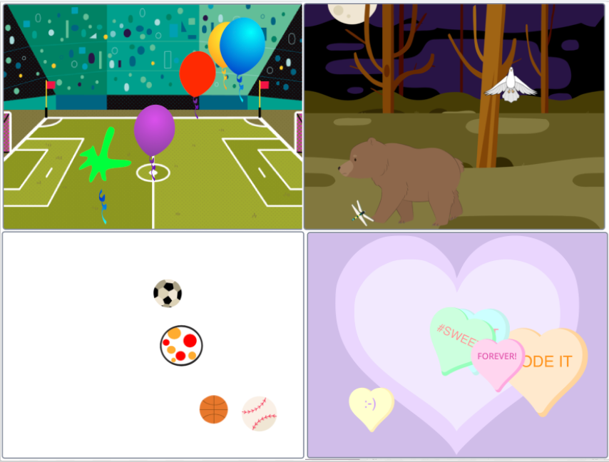
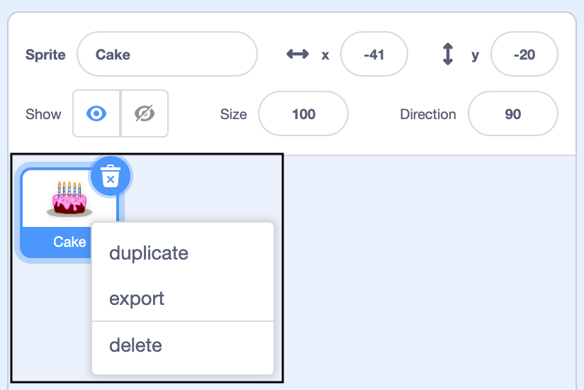

<style>
.scratch-preview
{
  display: none !important;
}

@media print
{    
    .scratch-preview
    {
      display: none !important;
    }

    .c-site-header {
      display: none;
    }


    .c-project__header img {
      max-width: 300px;
      height: auto;
    }

    .c-project-header__illustration
    {
      float: right;
    }

    .c-admin-banner
    {
       display: none !important;
    }

    img
    {
      max-width: 500px;
    }

    a::after{ content: " (" attr(href) ") "; } 

    body {
      font: 14pt Helvetica, Arial, Sans-Serif;
      line-height: 1.3;
      background: #fff !important;
      color: #000;
    }

    .c-project__header {
      border: 4px solid green;
      border-radius: 20px;
      padding: 15px;
      overflow: auto;
    }

   .c-project-header__illustration::after {
     clear: both;
   }

   .c-project__pagination {
    display: none;
   }

   h1::before {
      content: url(/assets/logomark-6c86cbce0a3461b707634ebd68a1618020ed632442c4b0339c81ae3a6816e326.svg) "  ";
    }

    h1 {
      font-size: 24pt;
      float: left;
      font: green;
    }

    h2 {
      border-bottom: 4px solid green;
      font-size: 22pt;
      counter-increment: step;
    }

    h2::before {
      content: "Step " counter(step) ": ";
    }
    

    h3 {
      margin-top: 5px;
      border-bottom: 1px solid grey;
      font-size: 22pt;
      padding: 2px 5px 2px 5px;
    }

    h4 {
      font-size: 14pt;
      margin-top: 25px;
    }

    .c-project-panel--ingredient {
      border-top: 5px dashed grey;
      border-bottom: 5px dashed grey;
      padding: 0px 15px 5px 15px;
      margin-top: 10px;
      margin-bottom: 10px;
    }

    .c-project-panel--save {
      background-image: url(/assets/project-save-icon-48c46c36456d406b5b74e2885155279816e4f98463fdb89e79cf2f0ea0904e44.svg));
    }

    h1, h2 {
      break-after: avoid-page;
    }

    .c-project-task__body {
      border-top: 1px solid green;
      border-bottom: 1px solid green;
    }

    .c-project-task__checkbox {
      right: 0px;
    }

    .c-project-panel--save {
      border: none;
      padding: none;
    }

    .c-project__menu {
      display: none;
    }

    .c-project-task__body {
      padding-right: 20px;
    }
}
</style>

## Introduction

You will create sprites that ‘emote’ to share their thoughts or feelings. 

A **sprite** is a character or object in a Scratch project. A sprite can have code, costumes and sounds to change the way it looks and what it does. 

You will:
+ add sprites and a **backdrop** to set up your project,
+ make the sprites communicate using `Looks`{:class="block3looks"} and `Sound`{:class="block3sound"} code blocks,
+ use the **Paint editor** to change a **costume**.

--- no-print ---

--- task ---
### Try it
<div style="display: flex; flex-wrap: wrap">
<div style="flex-basis: 200px; flex-grow: 1">  
Click on each sprite to see what they do. 

What happens if you click on one sprite and then quickly click on another?
</div>
<div class="scratch-preview" style="margin-left: 15px;">
  <iframe allowtransparency="true" width="485" height="402" src="https://scratch.mit.edu/projects/embed/485673032/?autostart=false" frameborder="0"></iframe>
</div>
</div>

--- /task ---

--- /no-print ---

--- print-only ---

--- /print-only ---

<p style="border-left: solid; border-width:10px; border-color: teal; background-color: aliceblue; padding: 10px;">
**Did you know?** 'emotes' are a way of showing the personality of a character in a game. They can use speech, sounds, movement and graphic effects, just like in Scratch. Do you play any games that use emotes?
</p>


## Get inspiration

You are going to create a Make a difference project to change someone's mood. The theme of the project, how it looks and the way the sprites move is up to you. 

You can get ideas for your own project by investigating projects created by others.

--- task ---

--- print-only ---

Have a look at the [Make a difference](https://scratch.mit.edu/studios/27756161){:target="_blank"} example projects from the Raspberry Pi Foundation Scratch studio.

--- /print-only ---

--- no-print ---

Click the green flags below to **experience** the example Scratch projects. Look at the appearance of each sprite and how they move. Can you identify the projects where the sprites are interactive?

Give some thought to **your** project's theme, how it will look and the way you want **your** sprites to move:

**Popping balloons** - <a href="https://scratch.mit.edu/projects/435808726/editor" target="_blank" style="background-color: #4d97ff; color: white; font-weight: bold; padding: 1rem; border-radius:.25rem; text-decoration:none;">See inside</a>

<div class="scratch-preview">
  <iframe src="https://scratch.mit.edu/projects/435808726/embed" allowtransparency="true" width="485" height="402" frameborder="0" scrolling="no" allowfullscreen></iframe>
</div>

**Bouncing balls** - <a href="https://scratch.mit.edu/projects/425675232/editor" target="_blank" style="background-color: #4d97ff; color: white; font-weight: bold; padding: 1rem; border-radius:.25rem; text-decoration:none;">See inside</a>

<div class="scratch-preview">
  <iframe allowtransparency="true" width="485" height="402" src="https://scratch.mit.edu/projects/embed/425675232/?autostart=false" frameborder="0"></iframe>
</div>

**Animal behaviour** - <a href="https://scratch.mit.edu/projects/433177517/editor" target="_blank" style="background-color: #4d97ff; color: white; font-weight: bold; padding: 1rem; border-radius:.25rem; text-decoration:none;">See inside</a>

<div class="scratch-preview">
  <iframe allowtransparency="true" width="485" height="402" src="https://scratch.mit.edu/projects/embed/433177517/?autostart=false" frameborder="0"></iframe>
</div>

**Love hearts** - <a href="https://scratch.mit.edu/projects/408665598/editor" target="_blank" style="background-color: #4d97ff; color: white; font-weight: bold; padding: 1rem; border-radius:.25rem; text-decoration:none;">See inside</a>

<div class="scratch-preview">
  <iframe allowtransparency="true" width="485" height="402" src="https://scratch.mit.edu/projects/embed/408665598/?autostart=false" frameborder="0"></iframe>
</div>

--- /no-print ---

--- /task ---
## Choose your theme

Now it's time to start working on your own project. You may be bursting with ideas already, or you may need to take a few minutes to decide on a theme you want to work with.

--- task ---

Open a [new Scratch project](https://scratch.mit.edu/projects/editor){:target=”_blank”}, to look at the range of sprites and backdrops, and take 5 minutes to think about **your** Make a difference project. 

+ What mood do you want to create? Relaxing, Energising, Funny?
+ Which backdrop will you choose? 
+ Which sprites will you choose? 
+ Maybe you will just start with one sprite and add more if you have time.


--- /task ---

--- task ---
Add a <span class="keyword">backdrop<span class="definition">A background image that appears behind all of the sprites and can't move.</span></span> of your choice. Don't worry too much as you can change at any time as you develop your idea. Below is an example of a **How to …**. You can use these if you need a reminder or to understand blocks in more detail.

[[[generic-scratch3-backdrop-from-library]]]

--- /task ---

--- task ---
Add your first <span class="keyword">sprite<span class="definition">A character or object in a project, such as a Cat or a Ball.</span></span>. You will always be able to change the way it looks or add more sprites later if you have time. 

[[[generic-scratch3-sprite-from-library]]]

--- /task ---

--- task ---

Give your project a name that matches your theme. 

--- collapse ---
---

title: How do I give my project a name?

---

Click in the project name box and change the name to match your project. 


If you share your project then others will see this name so make sure it makes sense. 

--- /collapse --- 

--- /task ---

--- save ---

<style>
.keyword {
  position: relative;
  display: inline-block;
  font-weight:bold;
  border-bottom: 2px dotted black;
}

.keyword .definition {
  visibility: hidden;
  font-weight: normal;
  width: 275px;
  background-color: white;
  color: black;
  text-align: left;
  border-radius: 6px;
  padding: 10px;
  border-width: 2px;
  border-style: solid;
  position: absolute;
  left: 0px;
  top: 35px;
  z-index: 1;
}

.keyword:hover .definition {
  visibility: visible;
}
</style>
## Animate using motion

Now it's time to get your first sprite moving. Start with one sprite and then add more. 

Each sprite will `move`{:class="block3motion"} within a <span class="keyword">`forever`{:class="block3control"} block<span class="definition">Runs the code blocks inside it forever, or until you click the red stop button above the Stage.</span></span> so that it keeps moving.

--- task ---

Think about how you want **your** sprite to move. For example, you might say "I want my sprite to move up and down the stage really slowly," or "I want my sprite to move quickly in a diagonal line." 

--- no-print ---

The **See inside** buttons in Scratch projects allow you to investigate a project's code. Click the below button to see inside 'Bouncing dragonfly'.

**Bouncing dragonfly** - <a href="https://scratch.mit.edu/projects/435667657/editor" target="_blank" style="background-color: #4d97ff; color: white; font-weight: bold; padding: 1rem; border-radius:.25rem; text-decoration:none;">See inside</a>

<div class="scratch-preview">
  <iframe src="https://scratch.mit.edu/projects/435667657/embed" allowtransparency="true" width="485" height="402" frameborder="0" scrolling="no" allowfullscreen></iframe>
</div>

--- /no-print ---

--- /task ---

--- task ---

Select your first sprite by clicking or tapping on it under the Stage.

Click on the **Code** tab. 

--- /task ---

--- task ---

Add code to make your sprite bounce and/or spin around the Stage in the way you want it to. 

If you need a reminder about how to create your sprite's movement when it bounces on the edge of the Stage then click the below **How to...**.

--- collapse ---
---

title: Bounce across the Stage

---
--- no-print ---

**Girl moving across the Stage** - <a href="https://scratch.mit.edu/projects/433535326/editor" target="_blank" style="background-color: #4d97ff; color: white; font-weight: bold; padding: 1rem; border-radius:.25rem; text-decoration:none;">See inside</a>

<div class="scratch-preview">
  <iframe src="https://scratch.mit.edu/projects/433535326/embed" allowtransparency="true" width="485" height="402" frameborder="0" scrolling="no" allowfullscreen></iframe>
</div>

--- /no-print ---

This code makes a sprite bounce on the left-hand and right-hand edges of the Stage. Because the sprite rotates horizontally it appears to flip when changing its direction `when flag  clicked`{:class="block3events"} is clicked:

```blocks3
when flag clicked
point in direction (90)
set rotation style [left-right v]
forever
move (5) steps
if on edge, bounce
```

The `point in direction`{:class="block3motion"} block automatically points your sprite to the right (`90` degrees) when the `green flag is clicked`{:class="block3events"}. If you change the number of degrees to `-90` your sprite will point left.

Add a `set rotation  style`{:class="block3motion"} block and select the drop-down `left-right`{:class="block3motion"} so your sprite won't flip upside down when it bounces off the edge of the Stage.  

**Tip:** You can drag your sprite on the Stage to move it to the y (up-down) position that you want.

--- /collapse ---

--- collapse ---
---

title: Bounce up and down the Stage

---
--- no-print ---

**Girl jumping** - <a href="https://scratch.mit.edu/projects/433595822/editor" target="_blank" style="background-color: #4d97ff; color: white; font-weight: bold; padding: 1rem; border-radius:.25rem; text-decoration:none;">See inside</a>

<div class="scratch-preview">
  <iframe src="https://scratch.mit.edu/projects/433595822/embed" allowtransparency="true" width="485" height="402" frameborder="0" scrolling="no" allowfullscreen></iframe>
</div>

--- /no-print ---

This code makes a sprite bounce up and down the Stage when the green flag is clicked:

```blocks3
when flag clicked
point in direction (0)
set rotation style [don't rotate v]
forever
move (5) steps
if on edge, bounce
```

Change the number of degrees in `point in direction`{:class="block3motion"} block to `0` to make a sprite point upwards when the green flag is clicked.

Add a `set rotation  style`{:class="block3motion"} block and select the drop-down `don't rotate`{:class="block3motion"} to stop your sprite rotating, even when it bounces.

**Tip:** You can drag your sprite around the Stage to move it to the x (left-right) position that you want.

--- /collapse ---

--- collapse ---
---

title: Bounce at an angle

---

--- no-print ---

**Football bouncing** - <a href="https://scratch.mit.edu/projects/433536479/editor" target="_blank" style="background-color: #4d97ff; color: white; font-weight: bold; padding: 1rem; border-radius:.25rem; text-decoration:none;">See inside</a>

<div class="scratch-preview">
  <iframe src="https://scratch.mit.edu/projects/433536479/embed" allowtransparency="true" width="485" height="402" frameborder="0" scrolling="no" allowfullscreen></iframe>
</div>

--- /no-print ---

This code makes a sprite appear to rotate randomly when the green flag is clicked:

```blocks3
when flag clicked
point in direction (45)
set rotation style [all around v]
forever
move (5) steps
if on edge, bounce
```

If your sprite moves at `45` degrees, you will find it appears to bounces off the edge of the stage in a random direction. Change the number of degrees in the `point in direction`{:class="block3motion"} block to `45` to make a sprite bounce all around.

Add a `set rotation  style`{:class="block3motion"} block and select the drop-down `all around`{:class="block3motion"} so your sprite will turn when it bounces off the edge of the Stage.  

--- /collapse ---

--- collapse ---
---

title: Spin around

---
--- no-print ---

**Bat spinning** - <a href="https://scratch.mit.edu/projects/435704980/editor" target="_blank" style="background-color: #4d97ff; color: white; font-weight: bold; padding: 1rem; border-radius:.25rem; text-decoration:none;">See inside</a>

<div class="scratch-preview">
  <iframe src="https://scratch.mit.edu/projects/435704980/embed" allowtransparency="true" width="485" height="402" frameborder="0" scrolling="no" allowfullscreen></iframe>
</div>

--- /no-print ---

This code makes a sprite spin when it is clicked:

```blocks3
when flag clicked
forever
turn right (1) degrees :: motion
```

Change the degrees by which your sprite turns to `1` within a `forever`{:class="block3control"} loop and your sprite will appear to spin.

**Tip:** If you don't add a `move`{:class="block3control"} block your sprite will spin in the position its in. 

--- /collapse ---

--- collapse ---
---

title: Move in a circle

---

--- no-print ---

**Moon orbit** - <a href="https://scratch.mit.edu/projects/435701055/editor" target="_blank" style="background-color: #4d97ff; color: white; font-weight: bold; padding: 1rem; border-radius:.25rem; text-decoration:none;">See inside</a>

<div class="scratch-preview">
  <iframe src="https://scratch.mit.edu/projects/435701055/embed" allowtransparency="true" width="485" height="402" frameborder="0" scrolling="no" allowfullscreen></iframe>
</div>

--- /no-print ---

This code makes a sprite fly in a circle when it is clicked:

```blocks3
when flag clicked
forever
move (1) steps
turn right (1) degrees :: motion
```

Change the degrees by which your sprite `moves`{:class="block3control"} to `1` and `turns`{:class="block3control"} to `1` within a `forever`{:class="block3control"} loop and your sprite will appear to move in a big cirle.

**Tip**: If you want your sprite to always start in the centre of the Stage, you can add `go to x:(0) y: (0)`{:class="block3motion"} before the `forever`{:class="block3control"}. 

--- /collapse --- 

--- /task ---

--- task ---
Remember to keep running your project to test it. Is the program working as you had planned?

It might take a few experiments to get suitable behaviour for your sprite.

You could try:
+ Dragging your sprite to a different starting location on the Stage.
+ Increasing the number of steps in `move ( ) steps`{:class="block3motion"} to make your sprite move faster or decreasing it to move slower.
+ Changing the number of degrees in `point in direction ( )`{:class="block3motion"} to change the direction that your sprites starts moving in. 
+ Changing the number of degrees in `turn right`{:class="block3motion"} or `turn left`{:class="block3motion"} so that your sprite turns faster or slower. 
+ Combining `move ( ) steps`{:class="block3motion"} and `turn right`{:class="block3motion"} or `turn left`{:class="block3motion"} blocks so that your sprite moves and turns. 
+ Experimenting with `set rotation style [ ]`{:class="block3motion"} to make sure you understand what the different options do

**Tip:** It's easier to identify issues if you make one change at a time and then run your program.

--- /task ---

--- save ---

<style>
.keyword {
  position: relative;
  display: inline-block;
  font-weight:bold;
  border-bottom: 2px dotted black;
}

.keyword .definition {
  visibility: hidden;
  font-weight: normal;
  width: 275px;
  background-color: white;
  color: black;
  text-align: left;
  border-radius: 6px;
  padding: 10px;
  border-width: 2px;
  border-style: solid;
  position: absolute;
  left: 0px;
  top: 35px;
  z-index: 1;
}

.keyword:hover .definition {
  visibility: visible;
}
</style>

## Change the look of your sprite
Now you're going to change the appearance of your sprite.

--- task ---
First think about how you want your sprite to look when your project starts. What size will look and work best? Do you want to use graphic effects to change the appearance of your sprite?

This **Jellyfish**  sprite is small and you can see the backdrop through it:

**Jellyfish** - <a href="https://scratch.mit.edu/projects/436254947/editor" target="_blank" style="background-color: #4d97ff; color: white; font-weight: bold; padding: 1rem; border-radius:.25rem; text-decoration:none;">See inside</a>
<div class="scratch-preview">
  <iframe src="https://scratch.mit.edu/projects/436254947/embed" allowtransparency="true" width="485" height="402" frameborder="0" scrolling="no" allowfullscreen></iframe>
</div>

--- /task ---

You will add new scripts to your sprite so you will have more than one script that starts with `when green flag clicked`{:class="block3control"}. Each script will all run at the same time when you click the green flag to start your project. 

--- task ---

Add code to your sprite to change the way it looks. Only make changes to your sprite if it makes sense. If you are already happy with the way your sprite looks you can move to the next task.

You can use these examples to get started:

--- collapse ---
---
title: Set size
---

When you add a sprite to your project its size is set to 100%. This might be too big or too small for your project. 

You can use code to set the size of a sprite. 

```blocks3
set size to (50) %
```

If you set the size of a sprite to 50% it will be half as tall and half as wide. If you set the size of a sprite to 200% it will be twice as tall and twice as wide. 

Place a `set size`{:class="block3looks"} block under a `when green flag clicked`{:class="block3control"} to set the size of a sprite when the project is started: 

```blocks3
when flag clicked
set size to (50) %
```

You can also quickly set the size of a sprite by changing its Size under the Stage:

{:width="400px"}

--- /collapse ---

--- collapse ---
---
title: Set graphic effects
---

**Rooster effects** - <a href="https://scratch.mit.edu/projects/435730522/editor/" target="_blank" style="background-color: #4d97ff; color: white; font-weight: bold; padding: 1rem; border-radius:.25rem; text-decoration:none;">See inside</a>

<div class="scratch-preview">
  <iframe allowtransparency="true" width="485" height="402" src="https://scratch.mit.edu/projects/embed/435730522/?autostart=false" frameborder="0"></iframe>
</div>

Place a `set graphic effects`{:class="block3looks"} block under a `when green flag clicked`{:class="block3control"} to set the size of a sprite when the project is started:

```blocks3
when flag clicked
set [ghost v] effect to (25)
```

The `set color`{:class="block3looks"} and `color`{:class="block3looks"} blocks both have drop down boxes where you can choose from a range of different graphic effects that can be used to change how your sprite appears.

+ `color`{:class="block3looks"}: from 0 to 199 (bigger numbers will wrap around so 200 is the same as 0)
+ `fisheye`{:class="block3looks"}: 0 is no effect and bigger numbers give a bigger 'bulge' effect
+ `whirl`{:class="block3looks"}: 0 is no effect, big number give a big whirl to the left, big negative number give a big whirl to the right
+ `pixelate`{:class="block3looks"}: 0 is no effect, bigger numbers give more pixels
+ `mosaic`{:class="block3looks"}: 0 is no effect, bigger numbers create more copies
+ `brightness`{:class="block3looks"}: 0 is no effect, bigger numbers up to 100 make the sprite lighter and negative numbers down to -100 make the sprite darker 
+ `ghost`{:class="block3looks"}: 0 is no effect, bigger numbers up to 100 make the sprite more transparent, 

Try `setting`{:class="block3looks"} the different effect values to see what each one does. Explore how different value changes make your sprite look.

```blocks3
set [whirl v] effect to (100)

set [pixelate v] effect to (50)
```

--- /collapse ---

--- collapse ---
---

title: Use the Fill tool to change the colours in a costume

---

Select your sprite under the Stage and then click on **Costumes**. 

Change the colour of your sprite. Click on the second sprite in the Sprite menu. Then select its **Costumes** tab.

Use the **arrow tool** to highlight whichever part of the costume you want to change colour.

{:width="200px"}

{:width="300px"}

Go to the **Fill tool** and select the colour. It will automatically fill the shape that you have selected.

{:width="300px"}

Repeat the steps above with any part of the costume you have missed or for any other part of the costume you want to change the colour of.

{:width="300px"}

{:width="300px"}

{:width="300px"}


--- /collapse ---

--- /task ---


--- task ---
Work on your sprite until it looks the way you want. 

**Tip:** It is always good to try one change at a time and test what it does so that you can easily undo any changes that you are not keen on, or make little changes as you go along.

--- /task ---


--- save ---
## Animate using looks
Now you're going to  to add `looks`{:class="block3looks"} blocks inside a `forever`{:class="block3control"} block to create an animation effect to make your sprite look more interesting.

--- task ---

Think about how you want to animate your sprite using `looks`{:class="block3looks"} blocks. 

The **Ghost** sprite is animated by its changing costume and brightness:

**Ghost animation** - <a href="https://scratch.mit.edu/projects/436255738/editor" target="_blank" style="background-color: #4d97ff; color: white; font-weight: bold; padding: 1rem; border-radius:.25rem; text-decoration:none;">See inside</a>
<div class="scratch-preview">
  <iframe src="https://scratch.mit.edu/projects/436255738/embed" allowtransparency="true" width="485" height="402" frameborder="0" scrolling="no" allowfullscreen></iframe>
</div>

--- /task ---

--- task ---
Add code to your sprite to create an animation effect. If you don't think your sprite needs an animation you can skip this task. 

Use one of the animation effects below as a starting point:

--- collapse ---
---
title: Change looks to create an animation effect
---

**Beating heart** - <a href="https://scratch.mit.edu/projects/435725413/editor/" target="_blank" style="background-color: #4d97ff; color: white; font-weight: bold; padding: 1rem; border-radius:.25rem; text-decoration:none;">See inside</a>

<div class="scratch-preview">
  <iframe allowtransparency="true" width="485" height="402" src="https://scratch.mit.edu/projects/embed/435725413/?autostart=false" frameborder="0"></iframe>
</div>

You can use the `set size`{:class="block3looks"} or `change size`{:class="block3looks"} to create a pulsing effect, such as a beating heart.

**Note:** The `set size`{:class="block3looks"} block sets size to a specific value while the `change size`{:class="block3looks"} changes the value from what it previously was, e.g. `change size by 10`{:class="block3looks"}, adds `10` to the value of size.

```blocks3
when flag clicked
set size to (160) %
forever
change size by (40)
wait (0.2) seconds
change size by (20)
wait (0.2) seconds
change size by (-20)
wait (0.2) seconds
change size by (-40)
wait (0.2) seconds
end
```

This code uses a series of `change size`{:class="block3looks"} and `wait`{:class="block3control"} blocks to make the heart grow and shrink. Try creating your own pulsating sprite.

You could also try changing `graphic effects`{:class="block3looks"} to create a sprite that keeps changing its appearance. 

```blocks3
when flag clicked
change [ghost v] effect by (75)
wait (1) seconds
change [ghost v] effect by (-75)
```

**Note:** If you use code that changes a graphic effect and then changes it back again, don't forget to use a `wait`{:class="block3control"} block in between, otherwise it will happen so fast that you won't see it!

You can use a `clear graphic effects`{:class="block3looks"} block at any time to reset the effects.

```blocks3
clear graphic effects
```

--- /collapse ---

--- collapse ---
---
title: Change costumes to make a simple animation
---

Some Scratch sprites have costumes that can be used to create a simple animation. 

**Avery walking** - <a href="https://scratch.mit.edu/projects/436256679/editor/" target="_blank" style="background-color: #4d97ff; color: white; font-weight: bold; padding: 1rem; border-radius:.25rem; text-decoration:none;">See inside</a>
<div class="scratch-preview">
  <iframe allowtransparency="true" width="485" height="402" src="https://scratch.mit.edu/projects/embed/436256679/?autostart=false" frameborder="0"></iframe>
</div>


Use `next costume`{:class="block3looks"} inside a `forever`{:class="block3control"} loop with a `wait`{:class="block3control"} to create an animation: 

```blocks3
when flag clicked
forever
next costume
wait (0.3) seconds
```

One second is often too long to wait before changing to the next costume so you need to use numbers smaller than 1 in the `wait` block. A wait of `0.1` is one tenth of a second and `0.5` is half a second. If you wait `0.2` seconds then the sprite will change costumes five times every second. 

When a sprite reaches its last costume,  the `next costume`{:class="block3looks"} block will go back to the first costume so the sprite will keep moving. 

You can combine animation with movement to create sprites that walk or fly.

--- /collapse ---

If your sprite doesn't have costumes that are suitable for animation then you can make your own:

--- collapse ---
---
title: Duplicate and edit a costume to use in an animation
---

Some Scratch sprites just have one costume or have multiple sprites that don't work as an animation. Choosing one costume and duplicating it and making a small change can create an animation effect. 

**Robot animation** - <a href="https://scratch.mit.edu/projects/436260207/editor/" target="_blank" style="background-color: #4d97ff; color: white; font-weight: bold; padding: 1rem; border-radius:.25rem; text-decoration:none;">See inside</a>

<div class="scratch-preview">
  <iframe allowtransparency="true" width="485" height="402" src="https://scratch.mit.edu/projects/embed/436260207/?autostart=false" frameborder="0"></iframe>
</div>

Switch to the Costumes tab for your sprite. 

The **Robot** sprite comes with costumes for three different robots and we only want to use one of them. Delete any costumes that you will not use in your animation. 

Right-click on the costume and choose 'Duplicate'. 

Make small changes to the costume such as moving, rotating or changing all or part of the costume or adding movement lines. 

If your costume uses Vector graphics then you can select parts of a costume to change. 


You can duplicate the costume again and make more changes to add more 'frames' to your animation.

You can now use your costumes in a simple sprite animation.

--- /collapse ---

--- /task ---

--- task ---
Work on your animation until you get the effect you want. 

Try changing the timing of your animation by changing the value in the `wait`{:class="block3control"} block. You might also want to change the movement code for the sprite. 

**Tip:** It is always good to try one change at a time and test what it does so that you can easily undo any changes that you are not keen on, or make little changes as you go along.

--- /task ---


--- save ---

## Do something when clicked

Now you're going to make your sprite do something `when this sprite clicked`{:class="block3events"}. Your sprite could play a `sound`{:class="block3sound"}, `move`{:class="block3motion"},  or change the way it `looks`{:class="block3looks"} or any combination. It's up to you. 

--- task ---

Decide what you want your sprite to do when the user clicks or taps on it. Choose an action that makes sense for your sprite. 

This chick chirps and jumps backwards when you click on it:

<div class="scratch-preview">
  <iframe src="https://scratch.mit.edu/projects/435649420/embed" allowtransparency="true" width="485" height="402" frameborder="0" scrolling="no" allowfullscreen></iframe>
</div>

--- /task ---

--- task ---

Add code to make your sprite do something when it is clicked. You can pick one of these examples as a starting point.

--- collapse ---

--- 

title: Click to make sound and motion

---

You can make your sprite perform an action such as playing a sound or moving when you click on it, and you can combine blocks to create a sequence of actions for the sprite to do every time you click on it. 

**Chirp and jump back when clicked** - <a href="https://scratch.mit.edu/projects/435649420/editor/" target="_blank" style="background-color: #4d97ff; color: white; font-weight: bold; padding: 1rem; border-radius:.25rem; text-decoration:none;">See Inside</a>
<div class="scratch-preview">
  <iframe src="https://scratch.mit.edu/projects/435649420/embed" allowtransparency="true" width="485" height="402" frameborder="0" scrolling="no" allowfullscreen></iframe>
</div>

Add code blocks under a `when this sprite clicked`{:class="block3events"} to run them when the sprite is clicked. This example plays a sound and move the sprite backwards. It can be used with a moving sprite. 

```blocks3
when this sprite clicked
play sound [chirp v] until done
move (-50) steps
```

--- /collapse ---


--- collapse ---
---

title: Click to change and then change back

---

You can add actions that make a change to a sprite and then reverse them such as growing, waiting and then shrinking. 

**Squash ball when clicked** - <a href="https://scratch.mit.edu/projects/435723273/editor/" target="_blank" style="background-color: #4d97ff; color: white; font-weight: bold; padding: 1rem; border-radius:.25rem; text-decoration:none;">See Inside</a>
<div class="scratch-preview">
  <iframe src="https://scratch.mit.edu/projects/435723273/embed" allowtransparency="true" width="485" height="402" frameborder="0" scrolling="no" allowfullscreen></iframe>
</div>

This code will grow a sprite and apply the fisheye effect for one second and then return to normal:

```blocks3
when this sprite clicked
set size to (110)
set [fisheye v] effect to (50)
wait (0.5) seconds
set [fisheye v] effect to (0)
set size to (100)
```

--- /collapse ---

--- collapse ---
---

title: Click to make a change, reset with green flag

---
You can make your sprite change when you click on it and then reset it when the green flag is clicked. 

**Balloon pop when clicked** - <a href="https://scratch.mit.edu/projects/435725465/editor/" target="_blank" style="background-color: #4d97ff; color: white; font-weight: bold; padding: 1rem; border-radius:.25rem; text-decoration:none;">See Inside</a>
<div class="scratch-preview">
  <iframe src="https://scratch.mit.edu/projects/435725465/embed" allowtransparency="true" width="485" height="402" frameborder="0" scrolling="no" allowfullscreen></iframe>
</div>

This code makes a balloon 'pop' using `sound`{:class="block3sound"} and `looks`{:class="block3looks"} blocks. 

```blocks3
when this sprite clicked
change size by (10)
change [brightness v] effect by (25)
wait (0.1) seconds
play sound [pop v] until done
set [ghost v] effect to (100)
```

You need to make sure you also have set up code so that your balloon is not popped when you start your project:

```blocks3
when flag clicked
set size to (100)
clear graphic effects
```

--- /collapse ---

--- /task ---

--- task ---
Keep changing and testing your code until you are happy with the way your sprite reacts when you click on it. 

--- /task ---

--- save ---

## Add more sprites
Now you've got one sprite moving the way you want it to, add another sprite to make your animation more dynamic.

--- task ---

Each sprite will have a different <span class="keyword">algorithm<span class="definition">A set of precise instructions for performing a task.</span></span> which makes its behaviour unique.

Ask yourself the following questions about your second sprite:
+ Where will you position it?
+ Do you want to change its colour or make it a new costume in the Paint Editor?
+ How big should it be? 
+ Which direction will it be pointing?
+ How will it move differently to the first sprite?

See how this project has two sprites.

**Astronaut and Spaceship** - <a href="https://scratch.mit.edu/projects/438623095/editor" target="_blank" style="background-color: #4d97ff; color: white; font-weight: bold; padding: 1rem; border-radius:.25rem; text-decoration:none;">See inside</a>
<div class="scratch-preview">
  <iframe src="https://scratch.mit.edu/projects/438623095/embed" allowtransparency="true" width="485" height="402" frameborder="0" scrolling="no" allowfullscreen></iframe>
</div>

--- /task ---

--- task ---

You may want to **Investigate** the example projects in **Step 2: Get inspiration**. If so, you could compare the programs of sprites whose movement and appearance are relevant to your project ideas. 

**Tip**: Professional programmers explore and take inspiration from code created by other programmers.

--- /task ---

--- task ---

Choose one of these three methods to create your second sprite: 
+ Duplicate your first sprite if you want multiples of the same sprite
+ Create a new sprite and copy over the first sprite's code 
+ Create a new sprite and start coding it from the beginning

--- collapse ---
---

title: Duplicate a sprite

---

Right click on your first sprite in the Sprite list below the Stage (or if you are using a tablet, tap and hold):
{:width="300px"}

Select 'duplicate'. This will create a copy of your first 1 sprite with the suffix '2':
{:width="300px"}

Rename your sprite:
{:width="300px"}

Your sprite's name will change in the Sprite list:
{:width="300px"}

Your second sprite has exactly the same code as your first sprite. Do not run the program until you have begun to alter the second sprite - you will not see the second sprite because it is sitting underneath the first sprite.

--- /collapse ---

--- collapse ---
---

title: Copy sprite code

---
In the Sprite menu, go to **Choose a Sprite** and select your second sprite.

Click the first sprite and go to its **Code** tab. Drag the code that is in the first sprite to the second sprite. You may have one script that starts with `when the green flag clicked`{:class="block3events"} as well as another script that starts with `when this sprite clicked`{:class="block3events"}. Make sure you copy **all** the code scripts that you have created. 

{:width="300px"}

Your second sprite has exactly the same code as your first sprite. Do not run the program until you have begun to alter the second sprite - you will not see the second sprite because it is sitting underneath the first sprite.

--- /collapse ---

--- /task ---

--- task ---

Now edit the code so that the new sprite animates the way you want it to. 

Go to **Step 4: Animate using  motions** for a reminder on how to add or change the second sprite's `point in direction`{:class="block3motion"} and `set rotation style`{:class="block3motion"}.

--- /task ---

--- task ---

Change how your second sprite appears in relation to the first sprite. Layering sprites helps them appear 3-dimensional in relation to each other and within the backdrop.

--- collapse ---
---

title: Layers

---
There are two ways to create layering.

Either, in the Stage area, click on the sprite you want as the front layer. Drag it over the front of the other sprite. This layering will stay when you run the program next time.

{:width="300px"}


Or, use a `go to front layer`{:class="block3looks"} block to the relevant sprite and select either a drop down `front`{:class="block3looks"} or `back`{:class="block3looks"} and add it to the set-up under a `when green flag clicked`{:class="block3events"} block.

```blocks3
go to [front v] layer
```

--- /collapse ---

--- /task ---

You may want to tweak the position, size, layers etc of your second sprite. It may take a few attempts before you are pleased with your second sprite's movement.

--- task ---

If you have time, keep adding more sprites. Make each one a little different to the others. 

--- /task ---

--- save ---


<style>
.keyword {
  position: relative;
  display: inline-block;
  font-weight:bold;
  border-bottom: 2px dotted black;
}

.keyword .definition {
  visibility: hidden;
  font-weight: normal;
  width: 275px;
  background-color: white;
  color: black;
  text-align: left;
  border-radius: 6px;
  padding: 10px;
  border-width: 2px;
  border-style: solid;
  position: absolute;
  left: 0px;
  top: 35px;
  z-index: 1;
}

.keyword:hover .definition {
  visibility: visible;
}
</style>

## Share

If you are in a club, why not share your project to friends and peers?

If you are at home, demonstate your project out with your family. 

If you have a Scratch account you can share your project through Scratch. Then you can send a link to people you know and the whole Scratch community will be able to find your project and try it out.

--- collapse ---
---

title: Share Scratch projects

---
--- /collapse ---

Why not invite your friends to create a project? Let them know how you had fun.

If you have a Scratch account and have shared your Looping sprites project, keep an eye out for comments that others may make about your creation. Feedback is a great way to reflect on your work. Ignore any comments which are negative or irrelevant.

## Reflect

How did your **Make a difference** project go? Is there anything you would do like to improve? 

Remind yourself what you have achieved:

--- task ---
I planned what I wanted a sprite to do and then used Scratch blocks to make it happen
--- /task ---
--- task ---
I used a **How to ...** to find out which code blocks to use to do what I wanted
--- /task ---
--- task ---
I clicked on 'See Inside' to view the code for a project
--- /task ---
--- task ---
I used an `if on edge, bounce`{:class="block3motion"} inside a `forever`{:class="block3control"} loop to make my sprite turn away from the edge of the stage
--- /task ---
--- task ---
I used a `forever`{:class="block3control"} loop to animate my sprite
--- /task ---
--- task ---
I modified a costume in the Paint editor
--- /task ---
--- task ---
I used `graphic effect`{:class="block3looks"} blocks to change how my sprite appeared
--- /task ---
--- task ---
I used the `when this sprite clicked`{:class="block3events"} block to create user interaction
--- /task ---
--- task ---
I used `size`{:class="block3looks"} or `layer`{:class="block3looks"} blocks to make the animation appear more 3-dimensional
--- /task ---
--- task ---
I tested my project and then made an improvement. 
--- /task ---

You can go back and improve your project whenever you have time.
## What next?

In this project, you have:

+ applied your skills to realise your own project ideas to create an interactive animation
+ selected appropriate blocks for your plan
+ think about what you've made and the ways you can improve it

If you are following the [Look after yourself](https://projects.raspberrypi.org/en/raspberrypi/look-after-yourself) pathway and have not completed the last three projects - Fruit salad, Relax and stretch and Focus on the prize - then now continue the pathway with [Fruit salad](https://learning-admin.raspberrypi.org/en/projects/fruit-salad).

If you have completed all the projects in the [Look after yourself](https://projects.raspberrypi.org/en/pathways/look-after-yourself) pathway then move on to the next Challenge project, [Project name](https://projects.raspberrypi.org/en/projects/project-name) project. In this project, you will make an interactive animation using `variables`{:class="block3variables"}.
## Inline code blocks and comments

In this project, you will use <code class="blocks" style="background-color: white">say [Hello!] for (2) seconds</code> to make your sprite show a speech bubble.


<code class="blocks" style="background-color: white">when flag clicked</code><code class="blocks" style="background-color: white">forever</code><code class="blocks" style="background-color: white">point towards (mouse-pointer v)</code><code class="blocks" style="background-color: white">if on edge, bounce</code><code class="blocks" style="background-color: white">say [Hello!] for (2) seconds</code>

```blocks3
when this sprite clicked
think [Hmm...] // thought bubble
change [color v] effect by [100] // number up to 200
wait [1] secs
think [] // hide bubble
clear graphic effects // back to normal colour
```

A really long comment:
```blocks3
change [color v] effect by [100] // number up to 200 number up to 200 number up to 200 number up to 200 number up to 200
```

<code class="blocks" style="background-color: white">when flag clicked</code><code class="blocks" style="background-color: white">forever // inline comment</code><code class="blocks" style="background-color: white">point towards (mouse-pointer v)</code>

<script>
scratchblocks.renderMatching("code.blocks", {
  inline: true,
  style:     'scratch3',   // Optional, defaults to 'scratch2'.
  // Repeat `style` and `languages` options here.
});
</script>
